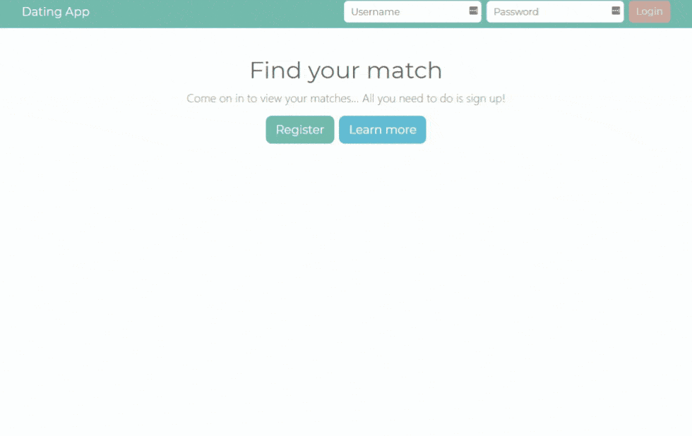

## Dating App

A simplified version of an online dating application. It was created for demonstration purpose only.

### Features

- Authentication: Sign-up, login and logout.
- Profile: Upload your photos and edit your details.
- Members: Paginated member listing, filters, view member details and photos.
- Likes: Like other members' profile based on their photos, bio, and common interests.
- Chat: Private chatting with other members.
- Admin Area: Approve or reject member photos, and manage user roles (Admin, Moderator, Member, VIP).

### Quick Preview

**Member View**
<kbd>

</kbd>

**Admin View**
<kbd>

</kbd>

### Quick Start

- Go to the [backend](./backend) folder and follow the README file instructions.

- Go to the [frontend](./frontend) folder and follow the README file instructions.

### Stack

- Backend

  - .NET Core 5 & C#
  - [Clean Code Architecture / DDD](https://docs.microsoft.com/en-us/dotnet/architecture/modern-web-apps-azure/common-web-application-architectures#clean-architecture)
  - RESTFul APIs
  - SQL Server database & EF Core
  - JWT authentication
  - Slack Notifications
  - Redis Cache
  - Swagger

- Frontend
  - Angular 6+ & Typescript
  - Reactive Forms & RxJS
  - Ngx-Bootstrap & Font Awesome

### Credits

This app was created based on [Neil Cummings](https://www.linkedin.com/in/necummings/)' course. [Build an app with ASPNET Core and Angular from scratch](https://trycatchlearn.com/course/build-an-app-with-aspnetcore-and-angular-from-scratch/).
